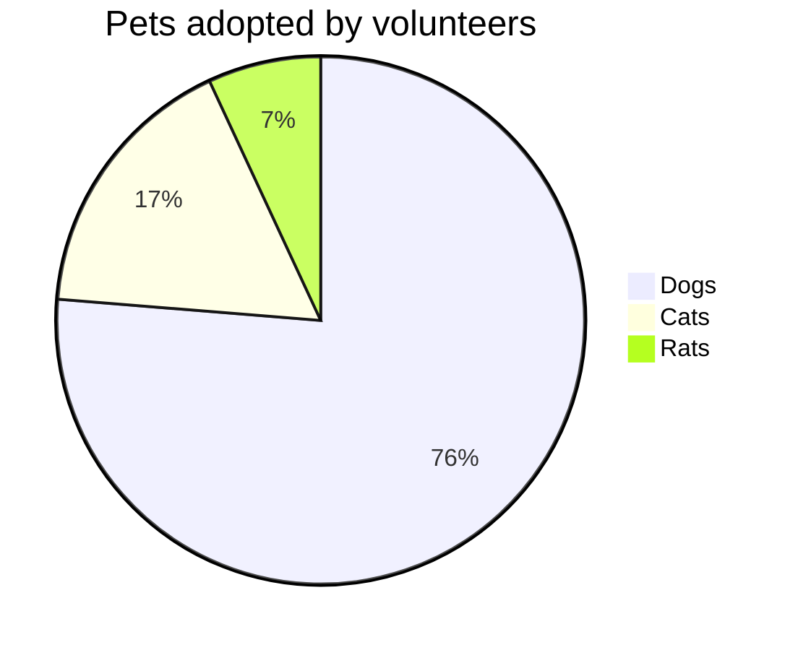

## What is mermaid? 

- [mermaid](https://mermaid-js.github.io/mermaid/#/)는 마치 html을 보다 간편한 문법인 Markdown을 통해 그릴 수 있도록 해준 것처럼, 복잡한 diagram을 마치 마크다운처럼 편한 문법으로 그릴 수 있도록 해주는 tool입니다.
- 가령, 아래와 같은 mermaid 문법을 `mermaid` 태그와 codeblock으로 작성해주면 diagram으로 그려주죠.

```plaintext
graph TD;
  A-->B;
  A-->C;
  B-->D;
  C-->D;
```

- 처음에는 VScode에서 간단하게 사용했습니다.
  - [Markdown Preview Mermaid Support](https://marketplace.visualstudio.com/items?itemName=bierner.markdown-mermaid)를 설치하여, Markdown Preview를 눌렀을 때, Diagram이 그려지도록 처리하고.
  - [Mermaid Markdown Syntax Highlighting](https://marketplace.visualstudio.com/items?itemName=bpruitt-goddard.mermaid-markdown-syntax-highlighting)를 사용하여, 문법들에 대해서 highlight해줬습니다.
- 그런데, 이렇게만 쓰지 않고 github 블로그에서도 사용해보려고 합니다.

## Rendering Mermaid in jekyll

- 저는 jekyll을 사용하고 있기 때문에, jekyll에서 mermaid를 렌더링해야 합니다.

### jekyll-mermaid

- [jekyll-mermaid](https://github.com/jasonbellamy/jekyll-mermaid)는 다음과 같은 방식으로 mermaid를 작성합니다.

```plaintext

graph TD;
    A-->B;
    A-->C;
    B-->D;
    C-->D;

```

- 한번 설치해보겠습니다.
- test for bash

```bash
ls
```

```plaintext
bundle add jekyll-mermaid
```

```plaintext
bundle add gem "jekyll-mermaid", "~> 1.0"
```

- 다음처럼 하면 잘 나와야 하는데, 나오지 않습니다 흠.

```plaintext

graph TD;
    A-->B;
    A-->C;
    B-->D;
    C-->D;

```

### spaceship

- 근데, 이게 github page에서 허용되는게 아니라서 안되는 것 같은데 흠.

```
$ bundle add jekyll-spaceship
```

```plaintext
gem "jekyll-spaceship", "~> 0.9.8"
```

- `_config.yml`의 plugins에 아래를 추가해줍니다.

```plaintext
plugins:
  - jekyll-spaceship
```

- 왜 아래가 표현이 안되나?? markdown-preview로는 아래 pie chart가 잘 그려지지만, jekyll로는 렌더링이 안되는 것처럼 보입니다.



- 테이블 테스트 

| :        Fruits \|\| Food       : |||
| :--------- | :-------- | :--------  |
| Apple      | : Apple : | Apple      \
| Banana     |   Banana  | Banana     \
| Orange     |   Orange  | Orange     |
| :   Rowspan is 4    : || How's it?  |
|^^    A. Peach         ||   1. Fine :|
|^^    B. Orange        ||^^ 2. Bad   |
|^^    C. Banana        ||  It's OK!  |

- uml 

```plantuml!
Bob -> Alice : hello world
```

- uml

@startuml
Bob -> Alice : hello
@enduml

- mermaid again 

@startmermaid
pie title Pets adopted by volunteers
  "Dogs" : 386
  "Cats" : 85
  "Rats" : 35
@endmermaid

- 야래의 방식으로 진행해 보자.

<script src="https://cdn.jsdelivr.net/npm/mermaid/dist/mermaid.min.js"></script>
<div class="mermaid"> graph TD; A-->B; A-->C; B-->D; C-->D; </div>


## Reference

- [jekyll-spaceship](https://github.com/jeffreytse/jekyll-spaceship)
