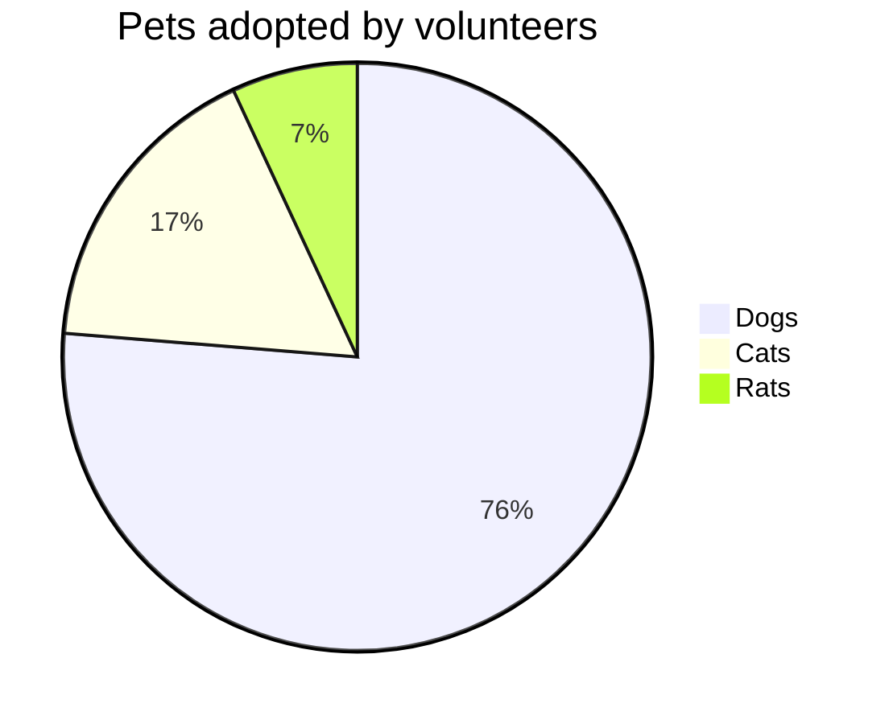

```plaintext

graph TD;
    A-->B;
    A-->C;
    B-->D;
    C-->D;

```

- 한번 설치해보겠습니다.
- test for bash

```bash
ls
```

```plaintext
bundle add jekyll-mermaid
```

```plaintext
bundle add gem "jekyll-mermaid", "~> 1.0"
```

- 다음처럼 하면 잘 나와야 하는데, 나오지 않습니다 흠.

```plaintext

graph TD;
    A-->B;
    A-->C;
    B-->D;
    C-->D;

```

### spaceship

- 근데, 이게 github page에서 허용되는게 아니라서 안되는 것 같은데 흠.

```
$ bundle add jekyll-spaceship
```

```plaintext
gem "jekyll-spaceship", "~> 0.9.8"
```

- `_config.yml`의 plugins에 아래를 추가해줍니다.

```plaintext
plugins:
  - jekyll-spaceship
```

- 왜 아래가 표현이 안되나?? markdown-preview로는 아래 pie chart가 잘 그려지지만, jekyll로는 렌더링이 안되는 것처럼 보입니다.



- 테이블 테스트 

| :        Fruits \|\| Food       : |||
| :--------- | :-------- | :--------  |
| Apple      | : Apple : | Apple      \
| Banana     |   Banana  | Banana     \
| Orange     |   Orange  | Orange     |
| :   Rowspan is 4    : || How's it?  |
|^^    A. Peach         ||   1. Fine :|
|^^    B. Orange        ||^^ 2. Bad   |
|^^    C. Banana        ||  It's OK!  |

- uml 

```plantuml!
Bob -> Alice : hello world
```

- uml

@startuml
Bob -> Alice : hello
@enduml

- mermaid again 

@startmermaid
pie title Pets adopted by volunteers
  "Dogs" : 386
  "Cats" : 85
  "Rats" : 35
@endmermaid

- 야래의 방식으로 진행해 보자.